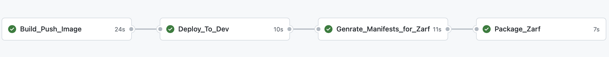

Hello world
===========

This is a source code repository with a sample application for which an App Dev team runs a regular SDLC. The repository contains a simple Go "Hello World" application forked from [rancher repository](https://github.com/rancher/hello-world). It also contains [Dockerfile](Dockerfile), [manifests helm templates](./helm) and a [CI/CD GH Actions workflow](.github/workflows/cicd.yaml).

## App.yaml

There is an [application descriptor](app.yaml) that App Dev team provides to the Platform Team. It describes to what targets/environments the application is supposed to be deployed during the SDLC and it defines where (repo/branch/folder) the manifests for each target are stored. 

```
template: app-manifests
deployments:
  development:
    target: development
    clusters: 1
    values:
      repository: https://github.com/[GITHUB-OWNER]/[GITHUB-REPO]
      branch: dev
      folder: rancher-hello-world
      zarf_image: [IMAGE_NAME]:zarf
  production:
    target: production
    clusters: 1
    values:
      repository: cc
      branch: prod
      folder: rancher-hello-world
      zarf_image: [IMAGE_NAME]:zarf      
```

## CI/CD flow

The CI/CD workflow contains the following stages:

 

 |Stage|Description|
 |-----|-----------|
 |Build and Push Image|Builds and pushes an image to the container registry. The tag is generated as SEM_VER-BUILD_NUM (e.g. 0.0.1-92)}
 |Deploy to Dev|Generates manifests with [Helm templates](./helm/) and PRs the manifests to the GitOps repo in `dev` branch under `rancher-hello-world` folder. The PR is auto-merged|
 |Generate Manifests to Zarf|Generates manifests with [Helm templates](./helm/) and PRs the manifests to the GitOps repo in `dev` branch under `rancher-hello-world` folder. This PR is supposed to be reviewed and merged|
 |Package Zarf| Tags the new image with `zarf` and invokes a workflow in the Control Plane Repo that creates a Zarf package containing application `prod` manifests and `zarf` image and uploads the package to Azure Storage|

 _*Note*_: The CI/CD workflow can successfully run after [customizations](#customizations) have been made and the application has been registered by the Platform Team in the Control Plane Repo.  


## Customizations
Once you have [migrated the repo to GitHub](#migrate-to-github), you need to make some customizations specific to your setup:

- In [app.yaml](app.yaml) update `manifests repo` (e.g. https://github.com/app-dev-team/missionedge-appdev-sample-manifests)
- Create [environments](https://docs.github.com/en/actions/deployment/targeting-different-environments/using-environments-for-deployment#creating-an-environment) in the GitHub repo: `dev`, `prod`, `zarf`. 
- Protect `prod` and `zarf` environments with [Required reviewers](https://docs.github.com/en/actions/managing-workflow-runs/reviewing-deployments).
- Update GitHub secrets:

|Secret|Description|Scope|
|------|-----------|-----|
|MANIFESTS_REPO| Manifests repo URL (e.g. https://github.com/app-dev-team/missionedge-appdev-sample-manifests)| Repository|
|MANIFESTS_FOLDER| Folder with manifests in the manifests repo (e.g. `rancher-hello-world`)| Repository|
|MANIFESTS_TOKEN| Token to PR to the manifests repo| Repository|
|IMAGE_NAME| Image name (e.g. `ghcr.io/app-dev-team/rancher-hello-world`)|   

## Migrate to GitHub

The repo is supposed to work in GitHub environment. There are tons of recommendations, command lines, tools to migrate Azure DevOps repos to GitHub.
Perhaps, the easiest way to do that is described here https://youtu.be/NjQhiVvTOds?t=53.
